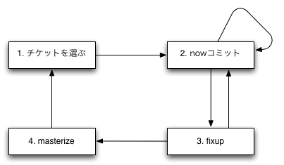

基本的な考え方
==============================

Mistilteinn(ミストルティン)とは
-------------------------------

Mistilteinn(ミストルティン)は、チケット管理システムとgitを組合せた開発をサポートするツールです。 既存のGitフロンドエンドと異なり、Gitを意識せせずに使えることを目標としています。

Mistilteinnでは下記のような開発スタイルをサポートします。

 * チケットごとにトピック・ブランチを作成する。
 * コミットにはチケット番号への参照を追記する。
 * トピック・ブランチでは頻繁にコミットを行ない、masterブランチに移動させる前に整理する。

Gitを開発のバックエンドに据えた、開発の新しい形、それがMistilteinnです。

使い方
------------------------------

チケットを選ぶ
^^^^^^^^^^^^^^^^^^^^^^^^^^^^^^

一覧から作業するチケットを選びます。

チケットリストのソースとしては、

 * ローカルファイル
 * Redmine
 * GithubのIssue

に対応しています。

チケットを選択すると、チケット番号に対応したブランチが作成されます。

nowコミット
^^^^^^^^^^^^^^^^^^^^^^^^^^^^^^

fixup
^^^^^^^^^^^^^^^^^^^^^^^^^^^^^^

masterize
^^^^^^^^^^^^^^^^^^^^^^^^^^^^^^
